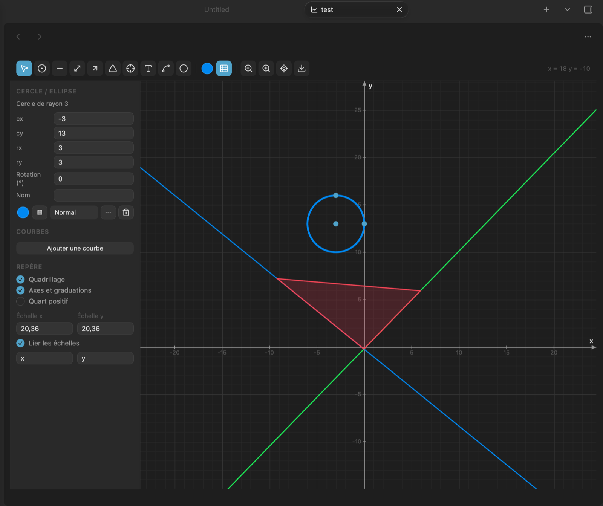
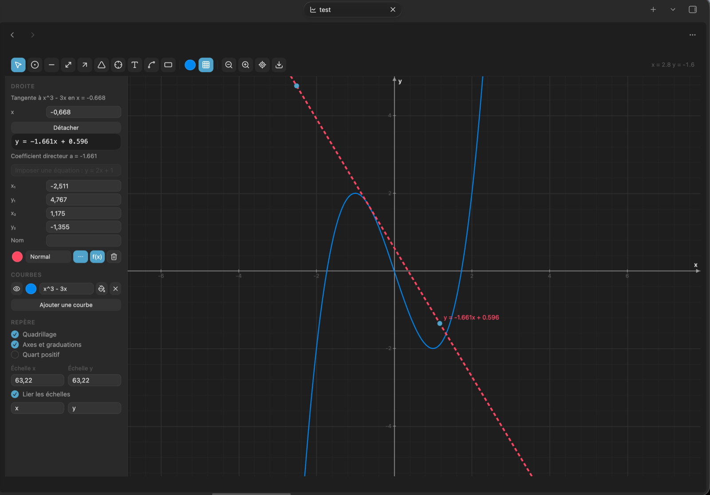
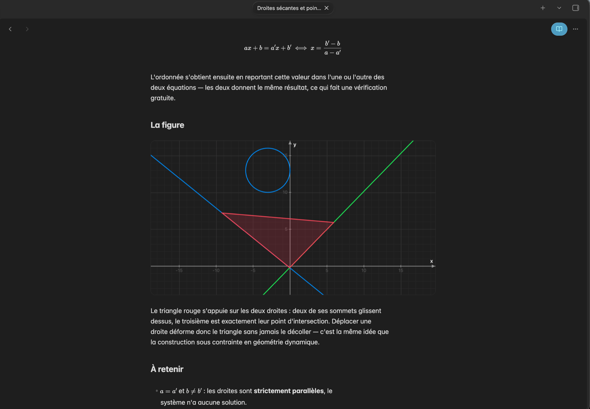

# Jexyllax's Graph

Draw mathematical and economics figures directly inside Obsidian notes: a
coordinate grid, function curves typed from the keyboard, lines, geometric
shapes, computed intersection points and tangents. Graphs are stored as
`.graph` files that open in their own tab, like a canvas, and can be embedded
in any note.

Everything runs locally: no network request, no external dependency, no build
step.



## Features

- **Coordinate grid** with independent X and Y scales, optional first-quadrant
  view for supply and demand diagrams, and free axis labels.
- **Function curves** typed in plain notation — `2x`, `3(x+1)`, `x²`, `e^x`,
  `sin(x)/x`, `√x`, `1/x`. French decimal commas (`0,5x`) are accepted.
- **Drawing tools**: point, segment, line, arrow, text, free shape, plus
  rectangle, square, circle, ellipse, triangles, rhombus, pentagon and hexagon.
- **Computed intersection points**: click two lines or curves and the exact
  point is placed, then recalculated whenever a parent moves or its equation
  changes.
- **Tangents**: click a curve to draw its tangent, with its equation.
- **Snapping** to existing points, endpoints, lines and curves — hold `Cmd` to
  place freely.
- **Attached endpoints**: a segment endpoint dropped on a point follows it.
- **Shaded areas**: under a curve between two bounds, or as free shapes.
- **Export** to PNG and PDF, or copy the image to the clipboard.
- **Note previews**: `![[my-graph.graph]]` renders the graph inside a note and
  counts as a regular link, so it appears in the graph view and in backlinks. A
  plain `[[my-graph.graph]]` alone on its line renders the same way, without the
  leading exclamation mark, in both reading mode and Live Preview. Hold `Cmd` (`Ctrl` on Windows) over a preview to pan
  and zoom it without opening the file; the framing stays local to that preview.
- **Bilingual interface**: English and French.

## Tangents and curves

Type a function in the side panel, then click the curve with the tangent tool.
The tangent carries its equation and is recomputed whenever the expression or
the abscissa changes.



## Graphs inside notes

A link to a graph, alone on its line, renders the figure in place — in reading
mode and while editing.



## Usage

Click the ribbon icon *Create graph*, use the command palette, or right-click a
folder and choose *New graph*. A `.graph` file is created and opens in its own
tab.

To place a graph in a note, run **Insert a graph into the note** from the
command palette, or copy the embed link from the export menu.

### Shortcuts

| Action | Shortcut |
| --- | --- |
| Pan / zoom | drag the background / scroll |
| Horizontal or vertical zoom only | `Shift` / `Alt` + scroll |
| Constrain to horizontal, vertical or 45° | `Shift` while drawing |
| Perfect square or circle | `Shift` while drawing a shape |
| Free placement, no snapping | `Cmd` while drawing |
| Rename an object | double-click |
| Nudge, duplicate, delete, undo | arrows, `Cmd+D`, `Del`, `Cmd+Z` |

## Settings

Language, help text, cursor coordinates, contextual messages, panel width,
default snapping, default colour and thickness, defaults applied to new graphs,
and note preview height.

## File format

`.graph` files are readable JSON: view position and scales, style options, the
list of functions, and the list of objects. Files written by earlier versions
are migrated on open.

## Development

No build step: `main.js` is plain JavaScript loaded directly by Obsidian.

The test suite runs outside Obsidian, in JavaScriptCore, with stubs for the
Obsidian API:

```sh
sh tests/run.sh
```

It covers the expression parser and accepted notations, line equations,
intersections, numeric root finding, polygons and geometric shapes, separate
scales, snapping, attached endpoints, tangents, rotation, file migration, the
translation tables, and the structure of the generated PDF.

## Licence

MIT.
